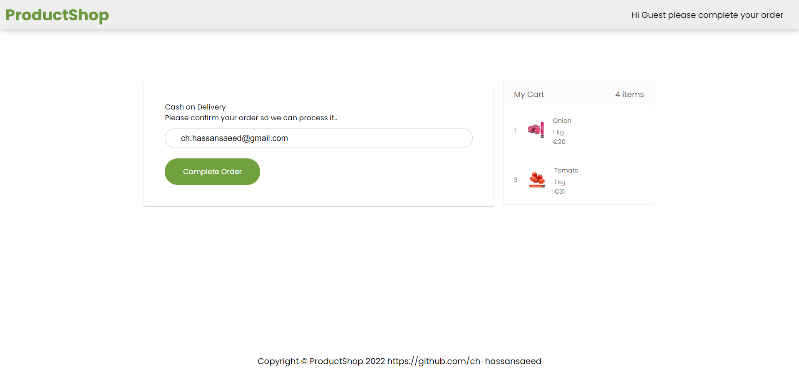

# ProductShop

ProductShop develop on ReactJs,Redux, Redux Thunk, Font Awesome, Local Storage and typescript where users can buy vegetables or products.

## Demo Snapshots

# `Home Products Page`

# `Product Cart`

# `Products Checkout Page`

## Installation and Setup Instructions

Install Node Js on your machine.

Install Pre-req Packages:

`npm install`

To Start App Server:

`npm start`

To Visit App Via Browser:

`http://localhost:3000`

# Future improvements

-Checkout page payment Methods
-Checkout page customer address  
-Checkout Page process order
-Order Management Page
-User Management Pages
-add to wishlist module
